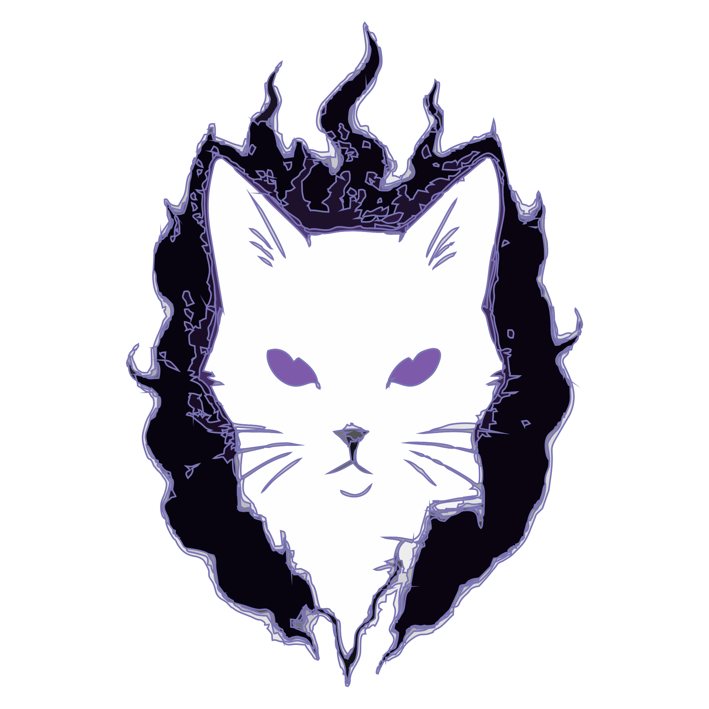

<h1 align="center">
 > PEDRO SOARES dev _
</h1>

  💻 Dev de infraestrutura e software — <b>redes</b>, <b>segurança</b> e <b>desempenho</b>. 
  🎮 Crio <b>jogos</b> (Godot), <b>APIs</b> (Django/Node), <b>automação</b> (Python) e <b>arquiteturas</b> escaláveis. 
  ⚡ <i>Desenvolvo por prazer desde sempre.</i>

---

## 🔧 Stack & Ferramentas

  <!-- Sistemas / Infra -->
  
  
  
  
  
  
  <!-- Linguagens / Back -->
  
  
  
  
  
  <!-- Game Dev -->
  
  <!-- DB -->
  
  <!-- Testes / API -->
  
  

  
  
  
  

---

## 🛠️ O que eu faço
- **Backend & APIs**: Django REST / Node.js, autenticação JWT, documentação Swagger/OpenAPI.  
- **Infra & DevOps**: Docker/K8s, Nginx, CI/CD, monitoramento, redes e servidores Linux.  
- **Segurança**: labs de **pentest**, hardening e análise de vulnerabilidades.  
- **Game Dev**: jogos com **Godot/GDScript** (single/multiplayer), assets e builds.  
- **Automação**: bots, ETL, scripts e produtividade.  
- **Arquitetura**: desenho de **sistemas escaláveis**, bancos relacionais e mensageria.  

---

## 🚀 Projetos que curto levantar
- 🌑 **Sites e painéis dark**  
- ⚙️ **APIs seguras e bem documentadas**  
- 🤖 **Ferramentas de automação**  
- 🎮 **Jogos em GDScript**  

---

## 📫 Contato

  
  
  

  

