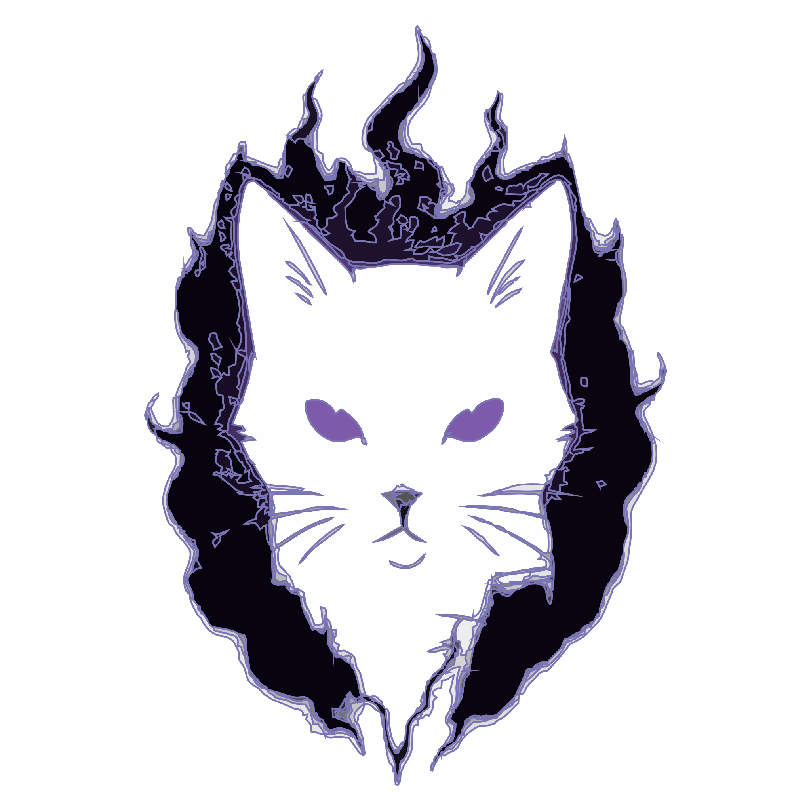

<h1 align="center">

</h1>

  💻 Dev de infraestrutura e software — <b>redes</b>, <b>segurança</b> e <b>desempenho</b>. 
  🎮 Crio <b>jogos</b> (Godot), <b>APIs</b> (Django/Node), <b>automação</b> (Python) e <b>arquiteturas</b> escaláveis. 
  ⚡ <i>Desenvolvo por prazer desde sempre.</i>

---

  <!-- 🐧 Sistemas / Infra -->
  
  
  
  
  
  

  <!-- ⚙️ Backend / APIs -->
  
  
  
  
  

  <!-- 🌐 Frontend -->
  
  
  
  

  <!-- 🗄️ Banco / Cache -->
  
  

  <!-- 🔌 APIs / Testes -->
  
  

  <!-- 📊 Observabilidade -->
  
  

  <!-- 🎮 Game Dev -->
  
  

  <!-- 🎨 Design -->
  
  

  <!-- 📐 Engenharia / CAD -->
  
  

  
  
  
  

---

- **Backend & APIs**: Django REST / Node.js, autenticação JWT, documentação Swagger/Postman.  
- **Infra & DevOps**: Docker/K8s, Nginx, CI/CD, Prometheus + grafana, redes e servidores Linux.  
- **Segurança**: labs de **pentest**, hardening e análise de vulnerabilidades.  
- **Game Dev**: jogos com **Godot/GDScript** (single), Level Design, Blender, Aseprite.  
- **Outros**: bots, Pentest com Kali/Arch Linux em servidores, Mentoria.  
- **Arquitetura**: desenho de **sistemas escaláveis**, bancos relacionais e mensageria com Redis.  

---

- 🌑 **Sites e painéis dark**  
- ⚙️ **APIs seguras e bem documentadas**  
- 🤖 **Ferramentas de automação**  
- 🎮 **Jogos em GDScript**
- 🖌️ **Artist**

---

  
  

  

